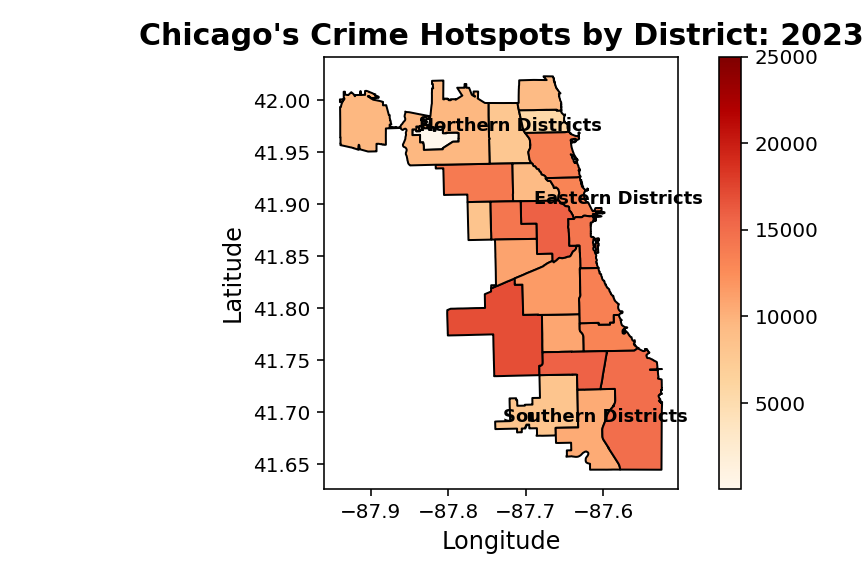
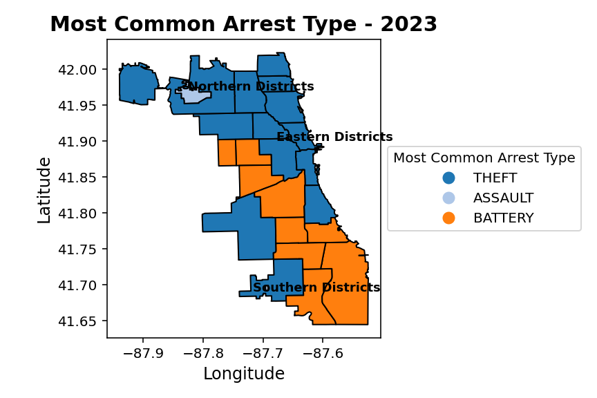
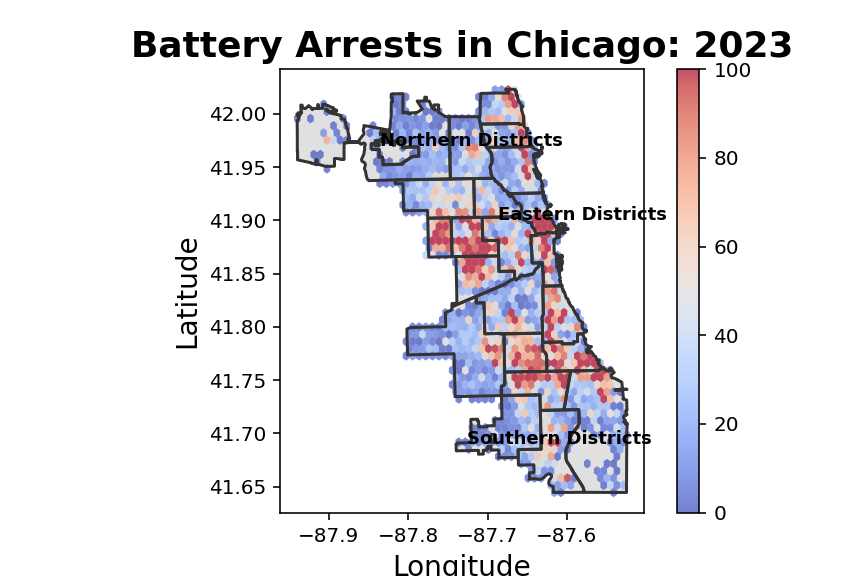
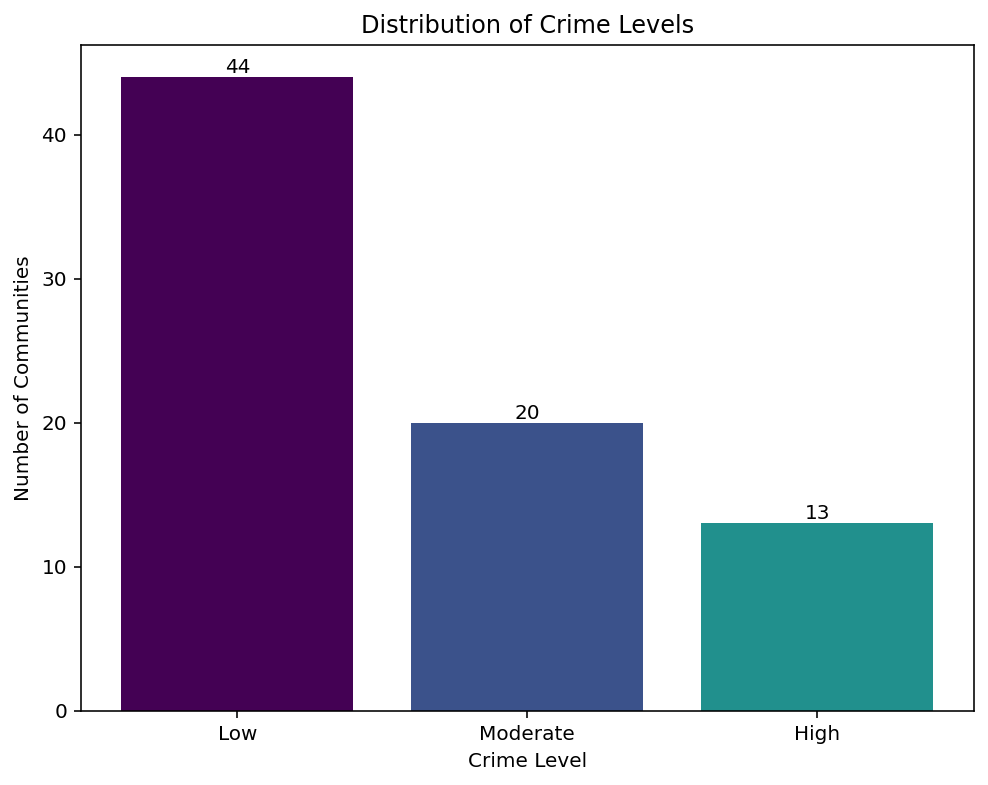
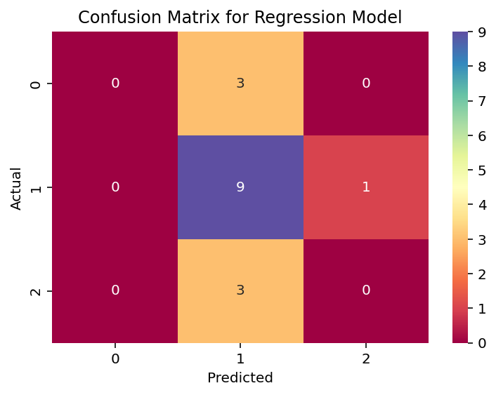

### Chicago Crime Analysis

### Overview
I built this project to explore and visualize patterns in Chicago crime data using a combination of **spatial analysis** and **machine learning models**. I’ve always been interested in how environment and socioeconomic conditions influence real-world outcomes, and this project was a way to use data to better understand those relationships at a citywide scale.

The analysis combines **geographic visualization**, **unsupervised clustering (KMeans)**, and **multinomial logistic regression** to examine where crime is concentrated across Chicago and how different areas compare in overall crime severity.

### What This Does
Given publicly available Chicago crime and census datasets, the system:

- Aggregates crime incidents by **police district** and **community area**
- Visualizes **crime hotspots** across Chicago districts
- Identifies the **most common arrest type** in each district
- Displays **spatial density** of arrests for a selected crime type
- Groups community areas into **Low**, **Moderate**, and **High** crime levels using KMeans clustering
- Uses **logistic regression** to predict crime level from socioeconomic indicators

Together, these components allow for both geographic comparison and community-level analysis of crime patterns.

### Spatial Analysis (District Level)
Using GeoPandas and Chicago police district boundaries, the spatial analysis component focuses on where crime occurs and how it varies across the city.

### Community Area Modeling (2008–2012)
At the community area level, the project shifts from visualization to modeling:

- Crime data is aggregated into **crime count**, **arrest rate**, and **domestic rate**
- **KMeans clustering** groups community areas into three crime-level categories
- A **multinomial logistic regression model** predicts crime level using census-based socioeconomic indicators
- Model performance is evaluated using a **classification report** and **confusion matrix**

This component helps connect observed crime patterns to their community characteristics.

### How It’s Built
The project is organized into two Python files:

- **`spatial_analysis.py`**  
  Handles district-level spatial visualization, including crime hotspot maps, most common arrest type by district, and arrest density plots.

- **`community_area_model.py`**  
  Performs community-area aggregation, KMeans clustering, and multinomial logistic regression using census-based socioeconomic indicators.

Each file can be run independently, but together they provide a geographic and analytical view of crime patterns in Chicago.

### Technical Concepts
This project touches a mix of data science, visualization, and modeling concepts, including:

- **Geospatial data processing with GeoPandas** 
- **Choropleth mapping and spatial density visualization**
- **Feature aggregation and rate-based metrics** 
- **Unsupervised learning with KMeans clustering**
- **Multiclass classification using logistic regression**
- **Model evaluation with confusion matrices and classification reports**
- **Data normalization and preprocessing**
- **Modular Python project structure**

### Data Clarification
This project uses publicly available datasets from the City of Chicago:

- **Crimes – 2001 to Present**
- **Selected Socioeconomic Indicators (2008–2012)**

Due to file size limitations, raw data files are not included in this repository. To run the analysis locally you can download the datasets and place them in a 'data' directory following the file paths referenced in the code.

### Results & Visualizations

#### Crime Hotspots by District (2023)

#### Most Common Arrest Type by District (2023)

#### Battery Arrest Density (2023)

#### Distribution of Crime Levels

#### Confusion Matrix for Crime Level Model

### Why This Project Matters
Crime data is inherently spatial and contextual. By combining geographic visualization with clustering and regression models, this project demonstrates how data can be used to move beyond raw counts and uncover meaningful patterns that vary across neighborhoods and districts.
